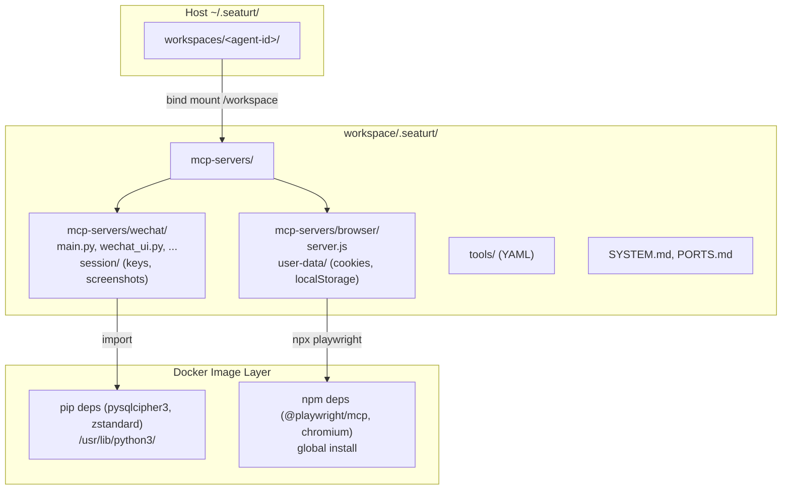

## 产品概述

将 Docker 镜像层中分散的 MCP Server 代码和 session 数据统一迁移到每个 Agent 的 workspace 目录下（`workspace/.seaturt/mcp-servers/`），通过已有的唯一 workspace bind mount 自然持久化，无需新增任何 Docker mount。实现：无需重建镜像即可修改代码，不同 Agent 可拥有不同版本的 MCP Server，所有持久化数据集中在 workspace 内。

## 核心特性

- WeChat MCP Server Python 代码部署到每个 Agent 的 `workspace/.seaturt/mcp-servers/wechat/`，容器内路径为 `/workspace/.seaturt/mcp-servers/wechat/`
- Browser Daemon Node.js 代码（`server.js`）部署到 `workspace/.seaturt/mcp-servers/browser/`，容器内路径为 `/workspace/.seaturt/mcp-servers/browser/`
- Browser 的 Chromium user-data 持久化到 `workspace/.seaturt/mcp-servers/browser/user-data/`（修复当前容器重建丢失 cookies/localStorage 的问题）
- WeChat session 数据统一到 `workspace/.seaturt/mcp-servers/wechat/session/`（去掉 symlink，去掉旧 wechat-session 目录）
- Python 代码中 SESSION_DIR 硬编码全部改用环境变量
- Docker 始终只有 1 个 bind mount（workspace），不新增任何 mount
- 每个 Agent 独立一份 MCP 代码，支持未来不同 Agent 使用不同版本的 skills
- npm/pip 依赖仍在镜像层（通过 NODE_PATH 环境变量让容器内 Node.js 找到镜像层中预装的 node_modules）

## 技术栈

- Go (seaturt-server): manager.go 新增 MCP 代码首次部署逻辑、config.go 新增路径方法
- Python (WeChat MCP Server): SESSION_DIR 改为环境变量驱动
- JavaScript/Node.js (Browser Daemon): USER_DATA_DIR 改为环境变量驱动
- Shell (wrapper/s6 脚本): 适配新路径 + 设置环境变量
- Docker: Dockerfile 精简（去掉代码 COPY，只保留依赖安装）

## 实现方案

### 核心策略

不新增任何 Docker bind mount。将 MCP Server 代码从镜像层 `/opt/` 迁移到 workspace 内的 `/workspace/.seaturt/mcp-servers/`。由于 workspace 已经通过唯一的 bind mount 映射到宿主机 `~/.seaturt/workspaces/<agent-id>/`，所有代码和数据自然持久化。

每个 Agent 创建时，Go 后端从 release 目录将 MCP 代码复制到该 Agent 的 workspace 下（首次部署）。

### 关键技术决策

**1. node_modules 问题的解决方案：NODE_PATH**

Browser daemon 的 `node_modules/`（含 playwright + chromium 二进制，约 300MB）必须留在镜像层。代码 `server.js` 迁移到 workspace 后，Node.js 的 `require()` 按照目录层级查找 `node_modules/` 会找不到依赖。

解决方案：在 Dockerfile 中将 npm install 安装到固定目录 `/opt/browser-daemon-deps/`，在 s6 服务脚本中设置 `NODE_PATH=/opt/browser-daemon-deps/node_modules`，Node.js 会自动从 NODE_PATH 查找依赖。

这样：

- 镜像层：只有 `node_modules/`（依赖 + playwright chromium），路径 `/opt/browser-daemon-deps/node_modules/`
- workspace：`server.js` + `user-data/`（代码 + 持久化数据）
- 零冗余，零额外 mount

**2. Python 依赖无需特殊处理**

`pysqlcipher3`、`zstandard` 等通过 `pip install` 安装到系统全局 `/usr/lib/python3/`，代码无论放在哪个路径下 `import` 都能找到。

**3. 容器内路径全面迁移**

```
迁移前:
  /opt/mcp-servers/wechat/main.py (镜像层, 不可变)
  /opt/mcp-servers/wechat/session -> symlink -> /workspace/.seaturt/wechat-session
  /opt/browser-daemon/server.js (镜像层, 不可变)
  /opt/browser-daemon/user-data/ (镜像层, 容器重建丢失!)

迁移后:
  /workspace/.seaturt/mcp-servers/wechat/ (workspace, 可编辑, 持久化)
    main.py, wechat_ui.py, wechat_db.py, ...
    session/ (密钥缓存、截图等, 直接存放)
  /workspace/.seaturt/mcp-servers/browser/ (workspace, 可编辑, 持久化)
    server.js
    user-data/ (Chromium cookies/localStorage, 持久化!)
  /opt/browser-daemon-deps/node_modules/ (镜像层, npm依赖)
```

### 实现细节

**1. config.go — 新增 `GetMCPServersSourceDir()`**

返回 release 目录下的 `mcp-servers/` 源码目录（供首次部署复制）。与现有 `GetMCPBinsDir()`、`GetPromptsDir()` 风格一致，默认为 `<serverDir>/mcp-servers/`。新增 `MCPServersDir` 配置字段，支持 yaml 和环境变量覆盖。

**2. manager.go — Create() 新增 MCP 代码部署**

在 `CreateContainer` 调用前、workspace 创建后：

- 创建 `<workspace>/.seaturt/mcp-servers/wechat/` 和 `.seaturt/mcp-servers/browser/` 目录
- 如果 `mcp-servers/wechat/` 目录为空（首次部署），从 `GetMCPServersSourceDir()/wechat/` 复制 Python 代码文件（`.py`、`mcp-server-wechat`、`requirements.txt` 等，排除 `test_*.py`、`build.sh`）
- 如果 `mcp-servers/browser/` 目录为空，复制 `server.js`（只有这一个文件需要）
- 创建 `mcp-servers/wechat/session/` 和 `mcp-servers/browser/user-data/` 子目录
- **移除旧的 wechat-session 预创建逻辑**（L227-234）

这个逻辑也需要在 `Start()` 中调用，确保 agent 重启时如果代码不存在能自动补充。

**3. Dockerfile 精简**

WeChat 部分：

- 保留 `COPY requirements.txt` + `pip install`（编译型依赖必须在镜像中）
- **去掉** `COPY mcp-servers/wechat/`（代码不再放镜像层）
- **去掉** `chmod +x`、`ln -sf` symlink
- 添加 `RUN mkdir -p /workspace/.seaturt/mcp-servers/wechat/session`（空目录占位）

Browser 部分：

- 将 npm install 目标改为 `/opt/browser-daemon-deps/`
- **去掉** `COPY server.js`
- 保留 `npm install + playwright install`
- 添加 `RUN mkdir -p /workspace/.seaturt/mcp-servers/browser/user-data`

**4. mcp-server-wechat wrapper 脚本更新**

```
WECHAT_MCP_DIR="/workspace/.seaturt/mcp-servers/wechat"
export WECHAT_SESSION_DIR="$WECHAT_MCP_DIR/session"
exec python3 "$WECHAT_MCP_DIR/main.py"
```

**5. s6 服务脚本更新**

`svc-wechat-run`:

- 去掉 `mkdir -p /workspace/.seaturt/wechat-session`
- 改为 `mkdir -p /workspace/.seaturt/mcp-servers/wechat/session`
- 设置 `export WECHAT_SESSION_DIR="/workspace/.seaturt/mcp-servers/wechat/session"`
- `exec python3 /workspace/.seaturt/mcp-servers/wechat/wechat_launcher.py --daemon`

`svc-browser-daemon-run`:

- 设置 `export NODE_PATH=/opt/browser-daemon-deps/node_modules`
- `mkdir -p /workspace/.seaturt/mcp-servers/browser/user-data`
- `exec node /workspace/.seaturt/mcp-servers/browser/server.js`

**6. Python SESSION_DIR 统一**

三个文件的 `SESSION_DIR` 全部改为：

```python
SESSION_DIR = os.environ.get("WECHAT_SESSION_DIR", "/workspace/.seaturt/mcp-servers/wechat/session")
```

**7. Browser server.js USER_DATA_DIR 更新**

```javascript
const USER_DATA_DIR = process.env.BROWSER_USER_DATA_DIR || "/workspace/.seaturt/mcp-servers/browser/user-data";
```

**8. build.sh 更新**

在 `build_server()` 中，额外将 MCP Server 源码复制到 release dir 的 `mcp-servers/` 子目录：

- `mcp-servers/wechat/`（Python 文件 + wrapper，排除测试文件）
- `mcp-servers/browser/server.js`

这些文件供 Go 后端在 Create Agent 时首次部署到 workspace。

### 性能与可靠性

- 零额外 bind mount —— Docker 配置不变，只有原来的 workspace mount
- 代码修改在宿主机 `~/.seaturt/workspaces/<agent-id>/.seaturt/mcp-servers/` 下直接编辑，容器内立即生效
- pip/npm 依赖在镜像层，首次启动不需要安装
- NODE_PATH 是 Node.js 官方支持的模块查找机制，零开销
- 每个 agent 独立 MCP 代码：一个 agent 的修改不影响其他 agent
- 未来 skills 管理天然兼容：每个 agent 的 `.seaturt/mcp-servers/` 就是该 agent 的 skills 目录

### 注意事项

- Browser daemon 的 Go 入口（`mcp-server-browser` 编译后的二进制）连接 `/tmp/mcp-browser.sock`，这个 socket 路径不变，不受迁移影响
- `npx @playwright/mcp@latest` 命令在 `server.js` 中通过 `spawn("npx", ...)` 调用，npx 位于 `/usr/bin/npx`（系统全局），不受 NODE_PATH 影响
- 但 `@playwright/mcp` 包需要被 npx 找到。npm install 安装的包在 `/opt/browser-daemon-deps/node_modules/` 下，npx 默认不会搜索 NODE_PATH。解决方案：将 server.js 中的 `npx @playwright/mcp@latest` 改为直接引用已安装包路径 `/opt/browser-daemon-deps/node_modules/.bin/playwright-mcp` 或通过 `node /opt/browser-daemon-deps/node_modules/@playwright/mcp/cli.js`。或者更简单：在 Dockerfile 中 `npm install -g @playwright/mcp`（全局安装），npx 就能找到。**选择全局安装方案**，最简洁。

## 架构设计



## 目录结构

```
# 迁移后每个 Agent 的 workspace 目录结构:
~/.seaturt/workspaces/<agent-id>/           # bind mount → /workspace
├── .seaturt/
│   ├── SYSTEM.md, PORTS.md
│   ├── tools/                              # MCP 二进制/YAML (不变)
│   ├── uploads/                            # 图片存储 (不变)
│   ├── mcp-servers/                        # [NEW] Per-Agent MCP Server 代码 + 数据
│   │   ├── wechat/                         # [NEW] WeChat MCP 代码（可直接编辑）
│   │   │   ├── main.py
│   │   │   ├── wechat_ui.py, wechat_db.py, wechat_db_query.py, ...
│   │   │   ├── wechat_launcher.py
│   │   │   ├── db_utils.py, key_extract.py
│   │   │   ├── mcp-server-wechat           # wrapper 脚本
│   │   │   ├── requirements.txt
│   │   │   └── session/                    # session 数据（密钥缓存、截图等）
│   │   └── browser/                        # [NEW] Browser daemon 代码
│   │       ├── server.js                   # Node.js daemon（可直接编辑）
│   │       └── user-data/                  # Chromium 持久化数据
│   └── (不再需要 wechat-session/)
└── (用户文件...)

# 源码修改清单:
seaturt-server/
├── docker/sandbox/
│   ├── Dockerfile                           # [MODIFY] 去掉 COPY wechat 代码/chmod/symlink; Browser 改为全局 npm install; 路径改为 /workspace/.seaturt/mcp-servers/
│   ├── svc-wechat-run                       # [MODIFY] 路径从 /opt → /workspace/.seaturt/mcp-servers/wechat/; 去掉旧 wechat-session 创建; 新增 WECHAT_SESSION_DIR 环境变量
│   ├── svc-browser-daemon-run               # [MODIFY] 路径从 /opt → /workspace/.seaturt/mcp-servers/browser/; 新增 NODE_PATH 环境变量
│   └── mcp-servers/
│       ├── wechat/
│       │   ├── mcp-server-wechat            # [MODIFY] WECHAT_MCP_DIR 从 /opt 改为 /workspace/.seaturt/mcp-servers/wechat; 新增 WECHAT_SESSION_DIR
│       │   ├── main.py                      # [MODIFY] SESSION_DIR 改用环境变量, 默认值改为 /workspace/.seaturt/mcp-servers/wechat/session
│       │   ├── db_utils.py                  # [MODIFY] SESSION_DIR 默认值更新
│       │   └── wechat_launcher.py           # [MODIFY] SESSION_DIR 改用环境变量, 默认值更新
│       └── browser/
│           └── server.js                    # [MODIFY] USER_DATA_DIR 改用环境变量, 默认值改为 /workspace/.seaturt/mcp-servers/browser/user-data
├── internal/
│   ├── config/config.go                     # [MODIFY] 新增 MCPServersDir 字段和 GetMCPServersSourceDir() 方法
│   └── agent/manager.go                     # [MODIFY] Create()/Start() 新增 MCP 代码首次部署到 workspace 逻辑; 去掉旧 wechat-session 预创建
├── tests/integration/
│   └── wechat_mcp_test.go                   # [MODIFY] 更新路径断言: /opt → /workspace/.seaturt/mcp-servers/; 去掉 symlink 测试
└── build.sh                                 # [MODIFY] build_server() 额外复制 mcp-servers 源码到 release dir 的 mcp-servers/ 子目录
```

## Agent Extensions

### SubAgent

- **code-explorer**
- Purpose: 在执行阶段搜索所有引用旧路径（`/opt/wechat-daemon/session`、`/opt/mcp-servers/wechat`、`/opt/browser-daemon`、`/workspace/.seaturt/wechat-session`）的代码位置，确保迁移无遗漏
- Expected outcome: 完整的改动点清单，确认所有旧路径引用都已更新