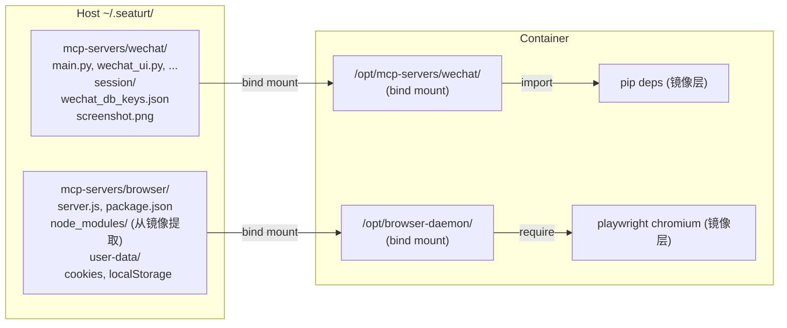

## 产品概述

将 Docker 镜像层中分散的 MCP Server 代码和 session 数据统一迁移到宿主机 `~/.seaturt/` 目录下，通过 bind mount 挂载到容器中，实现：无需重建镜像即可修改代码，所有持久化数据集中管理。

## 核心特性

- WeChat MCP Server Python 代码迁移到 `~/.seaturt/mcp-servers/wechat/`，通过 bind mount 覆盖容器内 `/opt/mcp-servers/wechat/`
- Browser Daemon Node.js 代码迁移到 `~/.seaturt/mcp-servers/browser/`，通过 bind mount 覆盖容器内 `/opt/browser-daemon/`
- Browser 的 Chromium user-data 一并持久化到 `~/.seaturt/mcp-servers/browser/user-data/`（当前未持久化，容器重建会丢失 cookies/localStorage）
- WeChat session 数据统一到 `~/.seaturt/mcp-servers/wechat/session/`（不再需要 symlink 和 workspace 内的 wechat-session 目录）
- 统一 Python 代码中散落的 `SESSION_DIR` 硬编码路径，全部改用环境变量
- 向后兼容：如果宿主机 `~/.seaturt/mcp-servers/` 不存在，仍使用镜像内预装代码

## 技术栈

- Go (seaturt-server): 新增 bind mount 逻辑、MCP 代码首次部署复制、config 路径管理
- Python (WeChat MCP Server): 统一 session 路径为环境变量驱动
- Shell (wrapper/s6 服务脚本): 适配新路径、设置环境变量
- Docker: Dockerfile 精简，去掉代码 COPY，只保留依赖安装和空目录

## 实现方案

### 核心策略

用 bind mount 覆盖容器内的 `/opt/mcp-servers/wechat/` 和 `/opt/browser-daemon/`，将代码和 session 数据都放到宿主机 `~/.seaturt/mcp-servers/` 下。

**选择 bind mount 覆盖原有路径而非改容器内路径**，原因：

1. 所有现有代码（wrapper 脚本、s6 服务、Python import、Go binary 的 socket 路径）都指向这些路径，覆盖可最小化改动
2. bind mount 是零开销的内核操作
3. 文件修改立即在容器内生效，无需重启

### 迁移前后路径对比

```
迁移前:
  镜像层(不可变): /opt/mcp-servers/wechat/ (Python代码)
  镜像层(不可变): /opt/browser-daemon/ (Node.js代码+user-data)
  symlink: /opt/mcp-servers/wechat/session -> /workspace/.seaturt/wechat-session
  容器内(丢失): /opt/browser-daemon/user-data/

迁移后:
  ~/.seaturt/mcp-servers/wechat/ -> bind mount -> /opt/mcp-servers/wechat/
    包含: Python代码 + session/（密钥缓存、截图等）
  ~/.seaturt/mcp-servers/browser/ -> bind mount -> /opt/browser-daemon/
    包含: server.js + package.json + node_modules/ + user-data/（Chromium数据持久化）
```

### 实现细节

**1. config.go - 新增 `GetMCPServersDir()`**

返回 `~/.seaturt/mcp-servers/`，与现有 `GetMCPBinsDir()`、`GetPromptsDir()` 风格一致。新增 `MCPServersDir` 配置字段，支持 yaml 配置和环境变量覆盖。

**2. manager.go - Create() 中新增 MCP 代码部署 + bind mount**

在 `CreateContainer` 调用前：

- 检查 `~/.seaturt/mcp-servers/wechat/` 是否存在，不存在则从 release dir 的 `docker/mcp-servers/wechat/` 复制（首次部署）
- 检查 `~/.seaturt/mcp-servers/browser/` 是否存在，不存在则从 release dir 的 `docker/mcp-servers/browser/` 复制（首次部署）
- 将这两个 bind mount 添加到 `ExtraMounts`（仅当目录存在时才挂载，向后兼容）
- 移除旧的 `wechat-session` 预创建逻辑，改为在 wechat 代码目录下创建 `session/` 子目录

ExtraMounts 格式: `["~/.seaturt/mcp-servers/wechat:/opt/mcp-servers/wechat", "~/.seaturt/mcp-servers/browser:/opt/browser-daemon"]`

**3. Dockerfile 精简**

```
# 之前: COPY 代码 + pip install + symlink
# 之后: 只保留依赖安装 + 创建空目录作为 bind mount 挂载点

# WeChat deps (编译型，必须在镜像中)
RUN pip install --no-cache-dir --break-system-packages pysqlcipher3 zstandard
RUN mkdir -p /opt/mcp-servers/wechat/session

# Browser deps (npm + playwright, 必须在镜像中)
COPY mcp-servers/browser/package.json /opt/browser-daemon/package.json
RUN cd /opt/browser-daemon && npm install --production \
    && npx playwright install chromium \
    && npx playwright install-deps chromium
RUN mkdir -p /opt/browser-daemon/user-data
```

去掉: `COPY mcp-servers/wechat/`, `chmod +x`, `ln -sf` symlink。

**4. Python SESSION_DIR 统一**

三个文件（`main.py`、`wechat_launcher.py`、`db_utils.py`）的 `SESSION_DIR` 全部改为：

```python
SESSION_DIR = os.environ.get("WECHAT_SESSION_DIR", "/opt/mcp-servers/wechat/session")
```

默认值从 `/opt/wechat-daemon/session` 改为 `/opt/mcp-servers/wechat/session`（代码目录下的 session 子目录），wrapper 脚本设置环境变量。

**5. wrapper 和 s6 服务脚本更新**

`mcp-server-wechat`:

- 新增 `export WECHAT_SESSION_DIR="$WECHAT_MCP_DIR/session"`

`svc-wechat-run`:

- 去掉 `mkdir -p /workspace/.seaturt/wechat-session`
- 改为 `mkdir -p /opt/mcp-servers/wechat/session`
- 新增 `export WECHAT_SESSION_DIR="/opt/mcp-servers/wechat/session"`

`svc-browser-daemon-run`:

- `mkdir -p /opt/browser-daemon/user-data` 保持不变（目录现在通过 bind mount 持久化）

**6. build.sh 更新**

`build_server()` 中除了复制 docker/ 目录外，还需复制 `mcp-servers/wechat/` 和 `mcp-servers/browser/` 到 release dir 的 `mcp-servers/` 目录（供首次部署使用）。

### 性能与可靠性

- bind mount 零开销（内核直接映射）
- 代码修改立即在容器内生效，无需重建镜像或重启容器
- pip/npm 依赖仍在镜像层（编译型依赖不可外移）
- 向后兼容：目录不存在时不添加 bind mount，镜像内预装代码仍可用

### 注意事项

- Browser daemon 的 `node_modules/` 在镜像中安装（因为 playwright chromium 二进制很大），首次部署到 `~/.seaturt/mcp-servers/browser/` 时不复制 `node_modules/`，让容器内镜像层的 `node_modules/` 和 bind mount 的 `server.js`/`package.json` 共存。**但 bind mount 会完全覆盖目录**，所以需要在首次部署时也从容器内复制 `node_modules/` 出来，或者改为只 mount `server.js` 和 `user-data/`。
- **关键决策**：Browser daemon 改为只 bind mount `server.js` 单文件和 `user-data/` 目录，不覆盖整个 `/opt/browser-daemon/`。这样 `node_modules/` 仍在镜像层。但 Docker bind mount 不支持文件级别挂载到目录内部... **因此 Browser 采用另一种策略**：在首次部署时从 Docker 镜像中把 `node_modules/` 也提取到宿主机，这样 bind mount 整个目录就完整了。通过 `docker cp` 从容器内提取一次。

## 架构设计



## 目录结构

```
~/.seaturt/                                        # 所有 SeaTurt 数据的统一根目录
├── config.yaml                                    # 全局配置
├── data.db                                        # SQLite 数据库
├── mcp-servers/                                   # [NEW] MCP Server 代码 + 数据
│   ├── wechat/                                    # [NEW] WeChat MCP (bind mount -> /opt/mcp-servers/wechat/)
│   │   ├── main.py, wechat_ui.py, ...            # Python 代码（可直接编辑）
│   │   ├── mcp-server-wechat                     # wrapper 脚本
│   │   └── session/                              # session 数据（密钥缓存、截图等）
│   └── browser/                                   # [NEW] Browser daemon (bind mount -> /opt/browser-daemon/)
│       ├── server.js, package.json               # Node.js 代码（可直接编辑）
│       ├── node_modules/                          # 从镜像提取（含 playwright）
│       └── user-data/                            # Chromium 持久化数据
└── workspaces/                                    # Agent 工作空间（不变）
    └── <agent-id>/
        └── .seaturt/
            ├── SYSTEM.md, PORTS.md, tools/, uploads/  # 不变
            └── (不再需要 wechat-session/)

# 源码修改清单:
seaturt-server/
├── docker/sandbox/
│   ├── Dockerfile                                 # [MODIFY] 去掉 COPY wechat 代码和 symlink, 精简为依赖安装+空目录
│   ├── svc-wechat-run                             # [MODIFY] session 路径更新, 去掉 workspace wechat-session 创建
│   ├── svc-browser-daemon-run                     # [MODIFY] 无需改动（路径不变）
│   └── mcp-servers/wechat/
│       ├── mcp-server-wechat                      # [MODIFY] 新增 WECHAT_SESSION_DIR 环境变量设置
│       ├── main.py                                # [MODIFY] SESSION_DIR 改用环境变量, 默认值更新
│       ├── db_utils.py                            # [MODIFY] SESSION_DIR 默认值更新为 /opt/mcp-servers/wechat/session
│       └── wechat_launcher.py                     # [MODIFY] SESSION_DIR 改用环境变量, 默认值更新
├── internal/
│   ├── config/config.go                           # [MODIFY] 新增 MCPServersDir 字段和 GetMCPServersDir() 方法
│   └── agent/manager.go                           # [MODIFY] Create() 新增 MCP 代码首次部署 + bind mount, 去掉 wechat-session 旧逻辑
├── tests/integration/
│   └── wechat_mcp_test.go                         # [MODIFY] 更新路径断言(去掉 symlink 测试, 更新 session 路径)
└── build.sh                                       # [MODIFY] release 时复制 mcp-servers 代码到 release dir
```

## Agent Extensions

### SubAgent

- **code-explorer**
- Purpose: 在执行阶段搜索所有引用旧路径（`/opt/wechat-daemon/session`、`/workspace/.seaturt/wechat-session`、`/opt/browser-daemon/user-data`）的代码位置，确保迁移无遗漏
- Expected outcome: 完整的改动点清单，保证 plan 覆盖所有需修改的文件