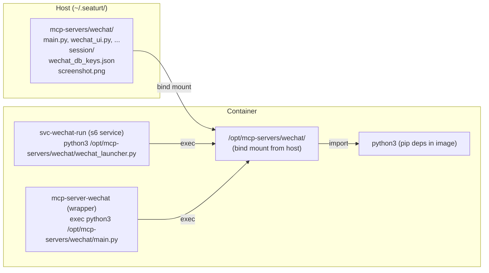

## Product Overview

将 WeChat MCP Server 的 Python 代码从 Docker 镜像内的 `/opt/mcp-servers/wechat/` 迁移到宿主机的 `~/.seaturt/mcp-servers/wechat/`，通过 bind mount 挂载到容器中，实现无需重建镜像即可修改代码。

## Core Features

- MCP Server Python 代码迁移到宿主机 `~/.seaturt/mcp-servers/wechat/`，通过新增 bind mount 挂载到容器 `/opt/mcp-servers/wechat/`（覆盖镜像内路径）
- 统一所有 session 路径：将 `main.py`、`wechat_launcher.py` 中的 `SESSION_DIR = "/opt/wechat-daemon/session"` 统一为 `/opt/mcp-servers/wechat/session`（复用 db_utils.py 的环境变量机制）
- 去掉 Dockerfile 中的 session symlink（不再需要，因为 session 目录直接在 wechat 代码目录下）
- Dockerfile 中只保留 pip 依赖安装和 `mkdir -p /opt/mcp-servers/wechat`（确保 bind mount 有挂载点）
- `build.sh` release 时仍然复制 wechat 源码到 release dir（作为默认代码）
- Go 后端：创建 Agent 时，如果配置了 wechat MCP，则将 wechat 代码目录复制到 `~/.seaturt/mcp-servers/wechat/`（首次部署），并新增 bind mount
- 保持向后兼容：如果 `~/.seaturt/mcp-servers/wechat/` 不存在，仍使用镜像内预装的代码（降级策略）

## Tech Stack

- Go (seaturt-server backend): 新增 bind mount 逻辑和 wechat 代码复制
- Python (MCP Server): 统一 session 路径
- Shell (wrapper/s6 服务脚本): 适配新路径
- Docker: Dockerfile 调整

## Implementation Approach

### 核心策略：`~/.seaturt/mcp-servers/wechat/` → bind mount → `/opt/mcp-servers/wechat/`

**为什么选择 bind mount 覆盖 `/opt/mcp-servers/wechat/` 而不是放到 workspace 内：**

1. 所有现有代码（wrapper、svc-wechat-run、Python 中的硬编码路径）都指向 `/opt/mcp-servers/wechat/`，覆盖这个路径可以最小化改动
2. session 数据（密钥缓存、截图等）自然随代码目录一起持久化，不再需要 symlink
3. 改动量最小，兼容性最好

**向后兼容：** 如果宿主机 `~/.seaturt/mcp-servers/wechat/` 不存在，不添加 bind mount，镜像内预装的代码仍然可用。

### 实现细节

**1. 路径映射变化**

```
迁移前:
  镜像层: /opt/mcp-servers/wechat/ (代码, 不可变)
  镜像层: /opt/mcp-servers/wechat/session → symlink → /workspace/.seaturt/wechat-session
  宿主机: /workspace/.seaturt/wechat-session/ (session 数据)

迁移后:
  宿主机: ~/.seaturt/mcp-servers/wechat/ (代码 + session, 可编辑)
    → bind mount → /opt/mcp-servers/wechat/ (覆盖镜像层)
  宿主机: ~/.seaturt/mcp-servers/wechat/session/ (session 数据, 同目录)
```

**2. Session 路径统一**

当前存在两个 session 路径：

- `main.py`: `SESSION_DIR = "/opt/wechat-daemon/session"` (硬编码)
- `db_utils.py`: `SESSION_DIR = os.environ.get("WECHAT_SESSION_DIR", "/opt/wechat-daemon/session")` (支持环境变量)
- `wechat_launcher.py`: `SESSION_DIR = "/opt/wechat-daemon/session"` (硬编码)

迁移后统一为：所有文件都使用 `os.environ.get("WECHAT_SESSION_DIR", "/opt/mcp-servers/wechat/session")`，由 wrapper 脚本设置环境变量。

**3. Go 后端改动**

在 `manager.go` 的 `Create()` 方法中：

- 查找 wechat 源码目录（优先 `~/.seaturt/mcp-servers/wechat/`，其次 release dir 下的 `docker/mcp-servers/wechat/`）
- 如果找到源码且 Agent 配置了 wechat，复制到 `~/.seaturt/mcp-servers/wechat/`（仅首次）
- 新增 bind mount: `~/.seaturt/mcp-servers/wechat/` → `/opt/mcp-servers/wechat/`
- 去掉旧的 wechat-session 目录预创建（session 现在在 wechat 代码目录内）

在 `docker.go` 的 `CreateContainerOpts` 中：

- 新增 `MCPServerMounts []string` 字段，支持额外的 MCP bind mount

**4. Dockerfile 改动**

```
- COPY mcp-servers/wechat/requirements.txt /opt/mcp-servers/wechat/requirements.txt
- RUN pip install --no-cache-dir --break-system-packages -r /opt/mcp-servers/wechat/requirements.txt
- COPY mcp-servers/wechat/ /opt/mcp-servers/wechat/
- RUN chmod +x /opt/mcp-servers/wechat/mcp-server-wechat
- RUN ln -sf /workspace/.seaturt/wechat-session /opt/mcp-servers/wechat/session

+ RUN pip install --no-cache-dir --break-system-packages pysqlcipher3>=1.2.0 zstandard>=0.22.0
+ RUN mkdir -p /opt/mcp-servers/wechat/session
```

- pip 依赖仍然在镜像中安装（系统级编译依赖）
- 只创建空目录作为 bind mount 挂载点
- 不再复制代码到镜像（代码从宿主机 bind mount）

**5. 性能与可靠性**

- bind mount 是零开销的（内核直接映射，无复制）
- 文件修改立即在容器内生效，无需重启
- 镜像仍包含 pip 依赖作为 fallback

## Architecture Design



## Directory Structure

```
seaturt-server/
├── docker/sandbox/
│   ├── Dockerfile                         # [MODIFY] 去掉 COPY wechat 代码, 改为 pip install + mkdir
│   ├── svc-wechat-run                     # [MODIFY] session 路径更新
│   └── mcp-servers/wechat/
│       ├── mcp-server-wechat              # [MODIFY] 加 WECHAT_SESSION_DIR 环境变量设置
│       ├── main.py                        # [MODIFY] SESSION_DIR 改用环境变量
│       ├── db_utils.py                    # [MODIFY] 默认值更新为 /opt/mcp-servers/wechat/session
│       ├── wechat_launcher.py             # [MODIFY] SESSION_DIR 改用环境变量
│       └── ... (其他 py 文件不变)
├── internal/
│   ├── agent/manager.go                   # [MODIFY] 新增 wechat 代码复制 + bind mount
│   ├── container/docker.go                # [MODIFY] CreateContainerOpts 增加 MCPServerMounts
│   └── config/config.go                   # [MODIFY] 新增 GetMCPServersDir()
├── tests/integration/
│   └── wechat_mcp_test.go                 # [MODIFY] 更新路径断言
└── build.sh                               # [MODIFY] release 时仍然复制 wechat 源码
```

## Agent Extensions

### SubAgent

- **code-explorer**
- Purpose: 搜索 Go 代码中所有引用 `/opt/mcp-servers/wechat` 和 `wechat-session` 的位置，确保无遗漏
- Expected outcome: 完整的改动点清单，保证 plan 覆盖所有需修改的文件