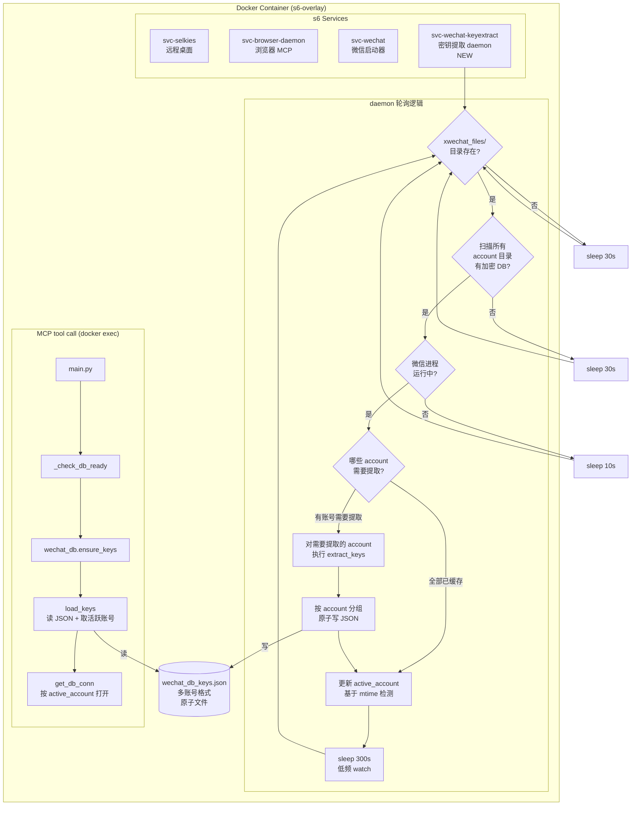

## 用户需求

修复微信 MCP 密钥提取在 ephemeral 进程模型下无法完成的严重 bug -- 当前后台线程（daemon=True）在 docker exec 进程退出时被杀，导致密钥提取永远无法完成。同时支持多微信账号场景（同一容器内切换登录不同微信号，磁盘上存在多个 wxid 数据目录）。

## 产品概述

新增一个容器内长驻 s6 service（`svc-wechat-keyextract`），容器启动后自动在后台轮询检测微信数据库是否出现，条件满足时执行密钥提取，结果以原子写方式存入 JSON 文件。MCP tool call（main.py）侧简化为纯缓存读取，不再启动任何后台线程。密钥缓存按微信账号（`wxid_xxx_hash`）分组，支持多账号数据互不覆盖，自动识别当前活跃账号。

## 核心功能

1. **长驻密钥提取守护进程**：新增 s6 longrun service，轮询等待微信安装、登录、数据库创建、进程运行四个条件全部满足后，执行同步密钥提取
2. **分阶段轮询策略**：等待数据库目录出现用 30s 间隔（低频事件）；等待微信进程运行用 10s 间隔；提取成功后进入 5 分钟低频 watch 模式
3. **原子写 JSON 缓存**：save_keys 改为写临时文件 + os.rename()，防止 MCP 读到半写文件
4. **MCP 侧简化**：wechat_db.py 的 ensure_keys() 去掉后台线程逻辑，简化为纯文件读取 + 验证；_check_db_ready() 相应调整提示信息
5. **失败自动重试**：提取失败后回到轮询状态，等条件重新满足后再试
6. **多微信账号支持**：密钥缓存按 `account_id`（`wxid_xxx_hash` 目录名）分组存储，不同账号的同名 DB（如 `message_0.db`）密钥互不覆盖；自动检测当前活跃账号；MCP 默认操作活跃账号

## 技术栈

- 运行环境：Docker 容器（linuxserver/webtop:ubuntu-kde + s6-overlay）
- 语言：Python 3（与现有 wechat MCP 代码一致）
- 密钥提取：key_extract.py 中的 extract_keys() 函数（C 扫描器 + /proc/PID/mem 内存搜索 + pysqlcipher3 验证）
- 进程管理：s6-overlay longrun service
- 数据持久化：JSON 文件（原子写）

## 实现方案

### 核心策略

将密钥提取从"每次 MCP tool call 时在 ephemeral 进程中异步触发"改为"容器内长驻 daemon 同步执行"。daemon 和 MCP tool call 通过 JSON 文件（`wechat_db_keys.json`）作为唯一通信介质，解耦两个进程。

### 关键技术决策

1. **s6 longrun 而非 oneshot**：daemon 需要持续轮询，不能是一次性任务
2. **同步提取而非异步线程**：daemon 是长驻进程，不再需要后台线程，直接同步调用 extract_keys()，代码更简单可靠
3. **文件系统作为 IPC**：daemon 写 JSON，MCP 读 JSON，通过 os.rename() 原子性保证一致性，无需 socket/pipe 等复杂 IPC
4. **依赖 svc-wechat 而非 svc-de**：密钥提取需要微信进程运行，而 svc-wechat 负责启动微信，所以新服务应依赖 svc-wechat 而非仅依赖桌面环境。但由于微信可能未安装，svc-wechat 可能一直在等待，所以新服务仍然依赖 svc-de，自己轮询微信状态
5. **按 account_id 分组的二层密钥缓存**：解决多微信账号下同名 DB 密钥互相覆盖的问题

### 多微信账号设计

#### 问题背景

微信数据目录结构为 `~/Documents/xwechat_files/<wxid>_<hash>/db_storage/*.db`，每个微信号有独立的子目录。Linux 微信是单进程单账号的，同一时间只能登录一个微信号，但切换账号后旧数据目录保留在磁盘上。

**原有缺陷**：密钥缓存是扁平字典（key = `db_name`），多个账号都有 `message_0.db`，后提取的会覆盖先提取的，导致数据丢失。

#### 新 JSON 缓存结构

```
{
  "_meta": {
    "active_account": "wxid_abc123_hash1",
    "updated_at": "2026-03-27 15:30:00"
  },
  "wxid_abc123_hash1": {
    "message_0.db": {"key": "aabb...", "compat": 4, "db_path": "/...wxid_abc.../db_storage/message_0.db", "found_time": "..."},
    "contact.db":   {"key": "aabb...", "compat": 4, "db_path": "/...wxid_abc.../db_storage/contact.db", "found_time": "..."},
    "session.db":   {"key": "aabb...", "compat": 4, "db_path": "/...wxid_abc.../db_storage/session.db", "found_time": "..."}
  },
  "wxid_def456_hash2": {
    "message_0.db": {"key": "ccdd...", "compat": 4, "db_path": "/...wxid_def.../db_storage/message_0.db", "found_time": "..."},
    "contact.db":   {"key": "ccdd...", "compat": 4, "db_path": "/...wxid_def.../db_storage/contact.db", "found_time": "..."}
  }
}
```

- `_meta.active_account`: 当前活跃账号的 account_id
- 每个顶层 key（除 `_meta`）是一个 account_id（`xwechat_files/` 下的目录名）
- 每个 account 内部是扁平的 `{db_name: info}` 结构

#### account_id 提取方法

从 DB 路径中提取：

```python
def extract_account_id(db_path: str) -> str:
    """从 db_path 中提取 account_id (xwechat_files 下的目录名)
    
    例：/home/ubuntu/Documents/xwechat_files/wxid_abc_hash1/db_storage/message_0.db
    → 返回 "wxid_abc_hash1"
    """
    parts = db_path.split("/")
    for i, part in enumerate(parts):
        if part == "xwechat_files" and i + 1 < len(parts):
            return parts[i + 1]
    # fallback: db_storage 的上一级目录名
    for i, part in enumerate(parts):
        if part == "db_storage" and i > 0:
            return parts[i - 1]
    return "unknown"
```

#### 活跃账号检测

daemon 通过比对各账号目录下 DB 文件的最新 mtime 来判断当前登录的是哪个账号：

```python
def detect_active_account(account_dbs: dict[str, list]) -> str | None:
    """根据 DB 文件 mtime 检测当前活跃账号
    
    Args:
        account_dbs: {account_id: [(db_path, rel, size, salt), ...]}
    Returns:
        最近修改的账号 ID
    """
    latest = (None, 0)
    for acct_id, dbs in account_dbs.items():
        for db_path, *_ in dbs:
            try:
                mt = os.path.getmtime(db_path)
                if mt > latest[1]:
                    latest = (acct_id, mt)
            except OSError:
                pass
    return latest[0]
```

### 性能与可靠性

- 密钥提取约 30-120 秒（编译 C 扫描器 + 读进程内存 + 多进程验证），daemon 可以承受
- 轮询间隔分层：30s（等 DB 目录）→ 10s（等微信进程）→ 300s（成功后 watch），CPU 开销极低
- 原子写防止读端看到不一致数据
- 提取成功后只在数据库文件集合变化时重新提取，避免无意义重复
- 多账号场景下，daemon 每轮扫描所有账号目录，对有新/变化 DB 的账号执行提取，已缓存且未变化的账号跳过

## 实现细节

### save_keys 原子写模式

```python
# 写临时文件后 rename，确保读端永远看到完整 JSON
tmp_path = path + ".tmp"
with open(tmp_path, 'w') as f:
    json.dump(keys_dict, f, indent=2, ensure_ascii=False)
os.rename(tmp_path, path)  # POSIX 原子操作
```

### daemon 缓存有效性检查（多账号版）

按 account 维度检查缓存覆盖率，而非全局扁平比对：

```python
def _needs_extraction(cached_keys: dict, account_dbs: dict) -> list[str]:
    """返回需要重新提取密钥的 account_id 列表
    
    Args:
        cached_keys: 完整缓存（含 _meta）
        account_dbs: {account_id: [(db_path, rel, size, salt), ...]}
    Returns:
        需要提取的 account_id 列表
    """
    need_extract = []
    for acct_id, dbs in account_dbs.items():
        cached_acct = cached_keys.get(acct_id, {})
        current_db_names = {os.path.basename(db[0]) for db in dbs}
        cached_db_names = set(cached_acct.keys())
        # 有新 DB 未被缓存覆盖 → 需要提取
        if not current_db_names.issubset(cached_db_names):
            need_extract.append(acct_id)
            continue
        # 缓存中的 db_path 不存在 → 需要提取
        for db_name, info in cached_acct.items():
            if not os.path.exists(info.get("db_path", "")):
                need_extract.append(acct_id)
                break
    return need_extract
```

### find_all_dbs 增强（按 account 分组返回）

```python
def find_all_dbs() -> dict[str, list]:
    """找到所有加密的微信数据库，按 account_id 分组。

    Returns:
        {account_id: [(db_path, rel_path, size, salt_hex), ...]}
    """
    search_bases = [
        os.path.expanduser("~/Documents/xwechat_files"),
        "/home/ubuntu/Documents/xwechat_files",
        "/root/Documents/xwechat_files",
    ]
    accounts = {}  # {account_id: [(db_path, rel, size, salt), ...]}
    for base in search_bases:
        if not os.path.isdir(base):
            continue
        for root, dirs, files in os.walk(base):
            if "db_storage" not in root:
                continue
            for f in sorted(files):
                if f.endswith('.db') and '-' not in f:
                    full = os.path.join(root, f)
                    sz = os.path.getsize(full)
                    if sz < 4096:
                        continue
                    with open(full, 'rb') as fh:
                        h = fh.read(16)
                    if h == b'SQLite format 3\x00':
                        continue
                    acct_id = extract_account_id(full)
                    rel = full.split('db_storage/')[-1] if 'db_storage/' in full else f
                    accounts.setdefault(acct_id, []).append((full, rel, sz, h.hex()))
    return accounts
```

### extract_keys 适配多账号

`extract_keys()` 函数签名和返回值调整——增加 `account_filter` 参数，密钥结果按 account 分组：

```python
def extract_keys(callback=None, account_filter: list[str] | None = None) -> dict:
    """全自动密钥提取。
    
    Args:
        callback: 进度回调
        account_filter: 只提取指定 account_id 列表的密钥（None = 全部）
    
    Returns:
        {
            "success": bool,
            "accounts": {account_id: {db_name: {"key":..., "compat":..., "db_path":...}}},
            "unlocked": int,
            "total": int,
            "elapsed": float,
            "error": str | None,
        }
    """
```

### WeChatDB 多账号适配

```python
class WeChatDB:
    CORE_DBS = {"message_0.db", "contact.db", "session.db"}
    
    def __init__(self):
        self._lock = threading.Lock()
        self._status = "not_started"           # not_started / ready / failed
        self._all_keys = {}                    # {account_id: {db_name: info}}
        self._active_account = None            # 当前活跃 account_id
        self._connections = {}                 # {(account_id, db_name): conn}
    
    def ensure_keys(self) -> bool:
        """加载缓存 → 验证活跃账号核心 DB → 标记 ready"""
        cached = load_keys()  # 多账号格式
        if not cached or "_meta" not in cached:
            return False
        active = cached["_meta"].get("active_account")
        if not active or active not in cached:
            return False
        acct_keys = cached[active]
        # 验证核心 DB 可打开
        valid_count = 0
        for db_name in self.CORE_DBS:
            if db_name in acct_keys and "key" in acct_keys[db_name]:
                db_path = acct_keys[db_name].get("db_path", "")
                if os.path.exists(db_path):
                    conn = try_open_db(db_path, acct_keys[db_name]["key"], verbose=False)
                    if conn:
                        conn.close()
                        valid_count += 1
        if valid_count > 0:
            with self._lock:
                self._all_keys = {k: v for k, v in cached.items() if k != "_meta"}
                self._active_account = active
                self._status = "ready"
            return True
        return False
    
    def get_db_conn(self, db_name: str, account: str | None = None):
        """获取数据库连接，默认用活跃账号，可指定 account"""
        acct = account or self._active_account
        ...
```

### _check_db_ready 调整

当 daemon 还未提取完成时，提示信息从"正在提取"改为"密钥提取服务正在后台工作中，请稍后重试"，不再显示 ephemeral 进程内的进度信息。

### wechat_status 增强

```python
# wechat_status tool 返回多账号信息
{
    "db_status": "ready",
    "active_account": "wxid_abc123_hash1",
    "accounts": ["wxid_abc123_hash1", "wxid_def456_hash2"],
    "core_dbs": {"message_0.db": true, "contact.db": true, "session.db": true},
    ...
}
```

## 架构设计



## 目录结构

```
seaturt-server/docker/sandbox/
├── svc-wechat-keyextract-run          # [NEW] s6 service 启动脚本。等待桌面就绪，设置 DISPLAY 和 WECHAT_SESSION_DIR 环境变量，exec python3 key_extract_daemon.py。遵循 svc-wechat-run 和 svc-browser-daemon-run 的相同模式。
├── svc-wechat-run                     # [无修改] 微信启动器
├── svc-browser-daemon-run             # [无修改] 浏览器 daemon
├── Dockerfile                         # [MODIFY] 新增 svc-wechat-keyextract 服务注册（COPY + chmod + type=longrun + dependencies.d/svc-de + user/contents.d）
└── mcp-servers/wechat/
    ├── key_extract_daemon.py          # [NEW] 长驻密钥提取 daemon。核心轮询循环：检测 xwechat_files 目录 → 扫描所有 account 目录的 db_storage/*.db → 检测微信进程 → 按 account 检查缓存有效性 → 对缺失/过期的 account 同步调用 extract_keys() → 检测活跃账号(mtime) → 原子写 JSON。包含 SIGTERM 信号处理（优雅退出），分阶段 sleep 策略，多账号缓存有效性比对逻辑。
    ├── wechat_db.py                   # [MODIFY] 简化为纯缓存读取模式 + 多账号支持：删除 extract_keys_async()、_do_extract() 和后台线程；ensure_keys() 简化为读 JSON + 取 active_account + 验证核心 DB；_keys 改为 {account_id: {db_name: info}} 结构；get_db_conn() 增加 account 可选参数；get_key_status() 返回多账号信息。
    ├── db_utils.py                    # [MODIFY] save_keys() 改为原子写；load_keys() 支持多账号格式读取；新增 extract_account_id()、detect_active_account() 辅助函数。
    ├── main.py                        # [MODIFY] _check_db_ready() 调整提示信息；wechat_status 返回多账号列表和活跃账号。
    └── key_extract.py                 # [MODIFY] find_all_dbs() 返回值改为按 account_id 分组的 dict；extract_keys() 增加 account_filter 参数，密钥结果按 account 分组返回。
```

## Agent Extensions

### SubAgent

- **code-explorer**
- Purpose: 在实现过程中如需确认 main.py 中其他引用 wechat_db 的位置、wechat_db_query.py 中的 DB 访问模式、或验证 Dockerfile 的精确插入点，用 code-explorer 进行跨文件搜索
- Expected outcome: 确保所有引用 wechat_db 旧接口的地方都被正确更新，特别是 get_db_conn() 调用处