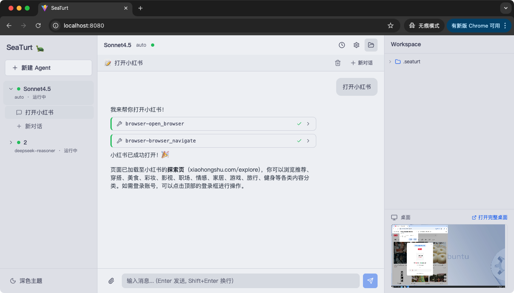
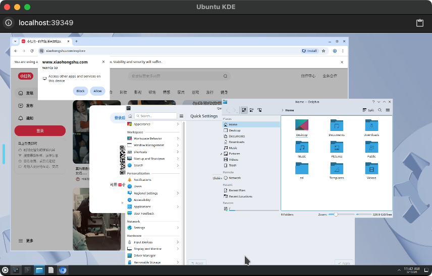
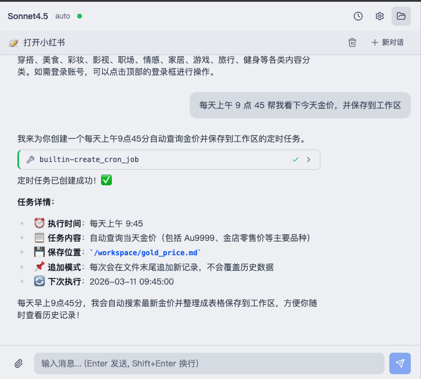
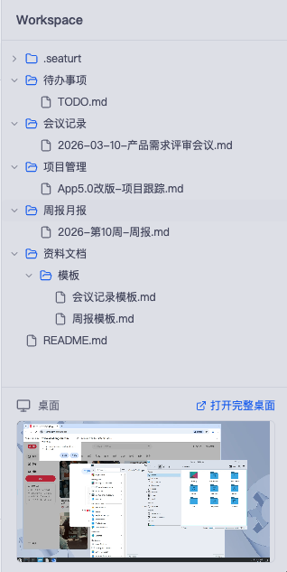
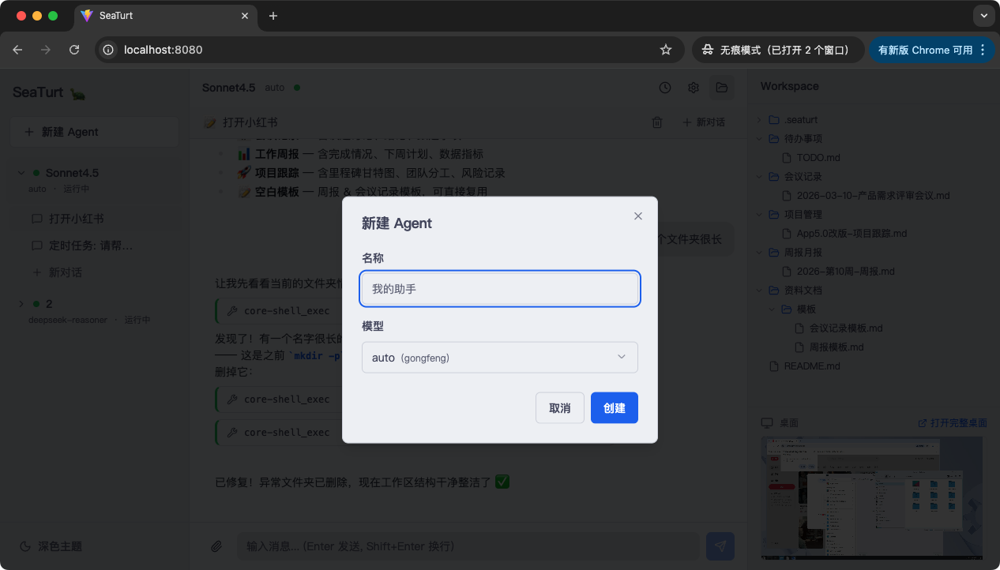

# 🐢 SeaTurt 小海龟

**安全、隔离、可视化的 AI Agent 平台**

让 AI 在独立的容器沙箱中工作，每个 Agent 都有自己的桌面环境——你可以实时看到它在做什么。

<!-- 截图：主界面全貌，左侧 Agent/Session 列表 + 中间对话区 + 右侧桌面预览和文件树 -->


---

## 为什么选择 SeaTurt？

### 🔒 容器隔离 — 让 AI 安全地工作

每个 Agent 运行在独立的 Docker 容器中，拥有自己的文件系统、网络和进程空间。无论 AI 执行什么操作——安装软件、运行脚本、修改文件——都不会影响你的电脑。

```
你的电脑 (安全)
 │
 ├── Agent A 的容器 🔒  ← 互相隔离
 ├── Agent B 的容器 🔒  ← 互相隔离
 └── Agent C 的容器 🔒  ← 互相隔离
```

- ✅ AI 的所有操作限制在沙箱内，不会动你的系统文件
- ✅ 多个 Agent 互不干扰，可以同时处理不同任务
- ✅ 通过 Workspace 目录与容器交换文件，你决定 AI 能看到什么

### 🖥️ 桌面环境 — 看见 AI 在做什么

每个容器内置完整的桌面环境（KDE Plasma），通过浏览器实时查看 AI 的操作画面。不懂代码也没关系，你可以像看直播一样观察 AI 工作。

<!-- 截图：右侧面板的桌面预览窗口，展示容器内桌面环境，AI 正在操作浏览器或编辑器 -->


- 👀 实时观看 AI 操作浏览器、编辑文件、运行程序
- 🖱️ 需要时可以直接接管桌面，手动操作
- 📸 AI 能自动截屏分析界面，完成视觉相关任务

### 💬 对话式交互 — 像聊天一样使用

通过自然语言与 Agent 对话，它会自动调用工具完成任务。整个执行过程实时展示，清晰透明。

<!-- 截图：对话区域，展示用户发消息 → AI 思考 → 调用工具（Tool 卡片展开）→ 返回结果的完整过程 -->


### 📂 文件管理 — 共享工作空间

每个 Agent 有独立的 Workspace 目录，宿主机与容器之间共享文件。你可以在右侧面板浏览文件、上传下载。

<!-- 截图：右侧面板的文件树，展示 Workspace 内的文件列表 -->


---

## 功能亮点

| 功能 | 说明 |
|------|------|
| 🔒 容器隔离 | 每个 Agent 独立 Docker 容器，安全沙箱 |
| 🖥️ 内置桌面 | KDE Plasma 桌面 + WebRTC 实时串流，浏览器直接观看 |
| 💬 流式对话 | SSE 实时推送 AI 思考和执行过程 |
| 🖼️ 多模态 | 支持文字 + 图片输入，AI 也能截屏分析界面 |
| 📂 文件共享 | Workspace 挂载，宿主机与容器无缝交换文件 |
| 🔌 多 Session | 同一 Agent 下多个独立对话，共享容器环境 |
| 🛠️ 工具调用 | 通过 MCP 协议执行 Shell、文件读写、浏览器操作等 |
| 🤖 多模型 | 支持 OpenAI / DeepSeek / 自定义 API，可随时切换 |
| 📦 一键安装 | 安装脚本自动检测环境、安装 Docker、构建镜像 |

---

## 快速开始

从 [Releases](https://github.com/NexF/SeaTurt/releases) 下载对应平台的安装包，解压后按以下步骤操作：

### 🍎 macOS / Linux

```bash
# 1. 解压
tar xzf seaturt-<version>-<os>-<arch>.tar.gz
cd seaturt-<version>-<os>-<arch>

# 2. 一键安装（自动检测环境、安装 Docker、构建沙箱镜像、引导配置）
./install.sh

# 3. 启动
./seaturt
```

打开浏览器访问 **http://localhost:8080** 即可开始使用。

<!-- 截图：macOS 终端中 install.sh 的运行过程，展示各步骤的绿色勾号 -->


> **支持**：macOS (Apple Silicon / Intel)、Ubuntu / Debian / CentOS / Fedora

### 🪟 Windows

Windows 通过 WSL2（Windows Subsystem for Linux）运行，安装脚本会自动帮你配置好一切：

```powershell
# 右键 install.ps1 → 使用 PowerShell 运行
# 或在管理员 PowerShell 中执行：
powershell -ExecutionPolicy Bypass -File install.ps1
```

安装脚本会自动完成：
1. ✅ 检测并安装 WSL2（如果尚未安装）
2. ✅ 安装 Ubuntu 发行版
3. ✅ 将 SeaTurt 复制到 WSL2 内部
4. ✅ 在 WSL2 中执行 `install.sh` 完成安装

> ⚠️ 首次安装 WSL2 需要**重启系统**，重启后再次运行 `install.ps1` 即可继续。

<!-- 截图：Windows PowerShell 中 install.ps1 的运行过程 -->


安装完成后，同样访问 **http://localhost:8080** 使用。

### 🔧 从源码构建（开发者）

```bash
# 前置条件：Go 1.23+、Node.js 18+、Docker

git clone https://github.com/NexF/SeaTurt.git
cd SeaTurt

# 一键构建（前端 + MCP Server + 后端 + Docker 镜像）
./build.sh release

# 启动
cd seaturt-server/release/darwin_arm64  # 替换为你的平台
./seaturt
```

### 配置 LLM

SeaTurt 需要配置 LLM API 才能工作。编辑 `config.yaml`（安装脚本会引导你完成）：

```yaml
providers:
  openai:
    base_url: https://api.openai.com/v1
    api_key: sk-your-api-key-here
    models:
      - id: gpt-4o
        name: GPT-4o
        input: [text, image]
```

也支持通过环境变量快速配置：

```bash
LLM_API_KEY=sk-xxx ./install.sh -y   # 全自动安装 + 配置
```

---

## 使用方式

### Web 界面（推荐）

启动后访问 http://localhost:8080，通过 Web 界面操作：

1. **创建 Agent** — 点击左侧 "+" 按钮
2. **开始对话** — 在输入框输入任务描述，发送即可
3. **查看桌面** — 右侧面板实时展示 Agent 的桌面画面
4. **管理文件** — 右侧面板切换到文件标签页，浏览/上传文件

<!-- 截图：创建 Agent 的弹窗，填写名称和选择模型 -->


### REST API

也提供完整的 REST API，适合集成和自动化场景：

```bash
# 创建 Agent
curl -X POST http://localhost:8080/api/agents \
  -H "Content-Type: application/json" \
  -d '{"name": "my-agent"}'

# 对话
curl -N http://localhost:8080/api/agents/<id>/chat \
  -H "Content-Type: application/json" \
  -d '{"content": [{"type": "text", "text": "帮我写一个 Python 爬虫"}]}'

# 更多 API 见文档
```

---

## 架构简介

```
用户 (浏览器)
  │
  ▼
SeaTurt Server ─── 管理多个 Agent
  │
  ├── Agent A ──→ Docker 容器 A (🖥️ 桌面 + 🛠️ 工具)
  ├── Agent B ──→ Docker 容器 B (🖥️ 桌面 + 🛠️ 工具)
  └── Agent C ──→ Docker 容器 C (🖥️ 桌面 + 🛠️ 工具)
```

- **SeaTurt Server**：Go 后端，管理 Agent 生命周期、对话、LLM 调用
- **Docker 容器**：每个 Agent 一个，内含桌面环境 + MCP 工具链
- **MCP 协议**：Agent 通过 MCP（Model Context Protocol）调用容器内工具
- **Web 前端**：React SPA，嵌入后端二进制，访问即用

---

## 文档

| 文档 | 说明 |
|------|------|
| [架构设计](docs/architecture.md) | 核心架构、请求流转、技术选型 |
| [Agent 架构](docs/agent.md) | Agent 数据模型、生命周期、Loop 循环 |
| [API 参考](docs/api.md) | REST API、数据模型、请求示例 |
| [Docker 容器](docs/docker.md) | 网络模式、端口映射、镜像策略 |
| [MCP 通信](docs/mcp.md) | MCP 协议、工具发现、执行机制 |
| [容器安全](docs/container.md) | 镜像设计、安全措施、隔离策略 |

---

## License

MIT
